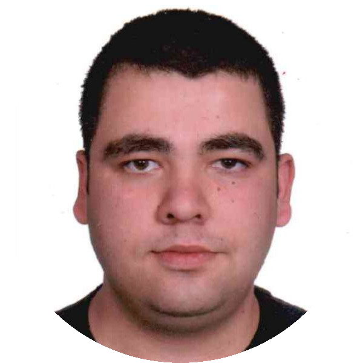

 

##👋� Welcome to My Workspace Assets


<h1 align="center"> 👋</h1>
<p align="center">
  
  <a href="https://oguzhanduyar.github.io/" target="_blank">
    
  </a>
  <a href="https://www.gnu.org/licenses/gpl-3.0.en.html" target="_blank">
    
  </a>
  <a href="https://twitter.com/https://twitter.com/4513484511345I4" target="_blank">
    
  </a>
</p>

> Some files are BSD licensed and the IMG directory is GPLv3 licensed.

### 🏠 [Homepage](https://oguzhanduyar.github.io/)

### ✨ [Demo](https://oguzhanduyar.github.io/)

## Install

```sh
git clone https://github.com/OguzhanDUYAR/My-Workspace-Assets.git
```

## Usage

```sh
git clone https://github.com/OguzhanDUYAR/My-Workspace-Assets.git
```

## Run tests

```sh
git clone https://github.com/OguzhanDUYAR/My-Workspace-Assets.git
```

## Author

👤 **Oguzhan DUYAR**

* Website: https://oguzhanduyar.github.io/
* Twitter: [@https:\/\/twitter.com\/4513484511345I4](https://twitter.com/https:\/\/twitter.com\/4513484511345I4)
* Github: [@OguzhanDUYAR](https://github.com/OguzhanDUYAR)
* LinkedIn: [@https:\/\/www.linkedin.com\/in\/oguzhan-duyar-7b384a180\/](https://linkedin.com/in/https:\/\/www.linkedin.com\/in\/oguzhan-duyar-7b384a180\/)

## 🤝 Contributing

Contributions, issues and feature requests are welcome!<br />Feel free to check [issues page](https://github.com/OguzhanDUYAR/My-Workspace-Assets/issues). You can also take a look at the [contributing guide](https://github.com/OguzhanDUYAR/My-Workspace-Assets/wiki).

## Show your support

Give a ⭐️ if this project helped you!

## 📝 License

Copyright © 2022 [Oguzhan DUYAR](https://github.com/OguzhanDUYAR).<br />
This project is [BSD--3 & GPLv3](https://www.gnu.org/licenses/gpl-3.0.en.html) licensed.

<p align="center" float="right">
  
   
  
</p>
